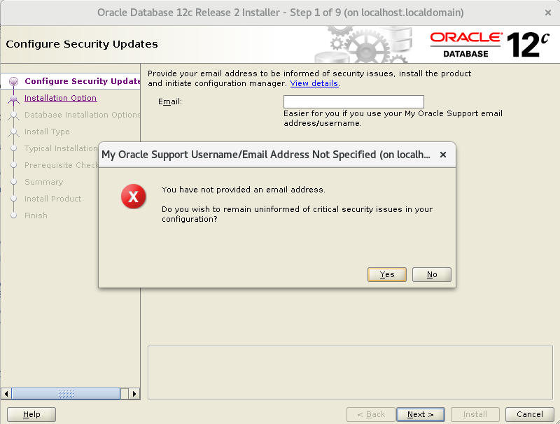
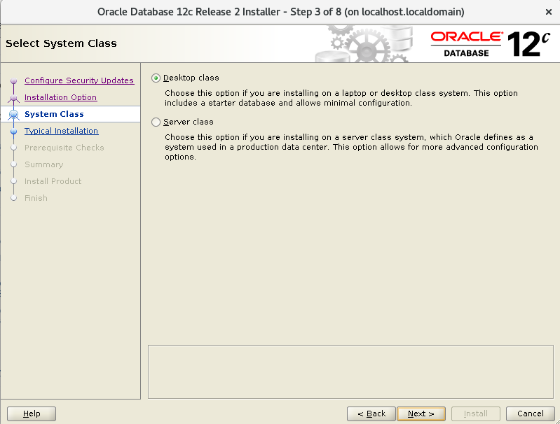
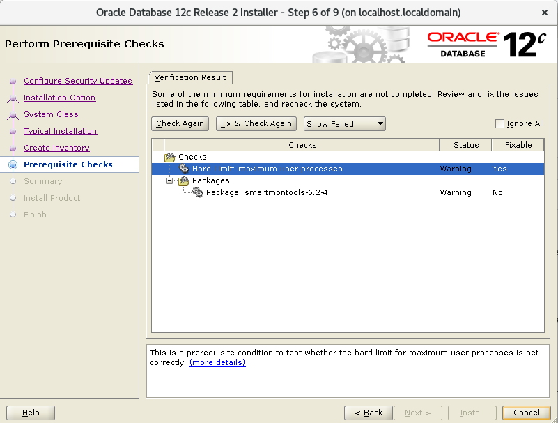
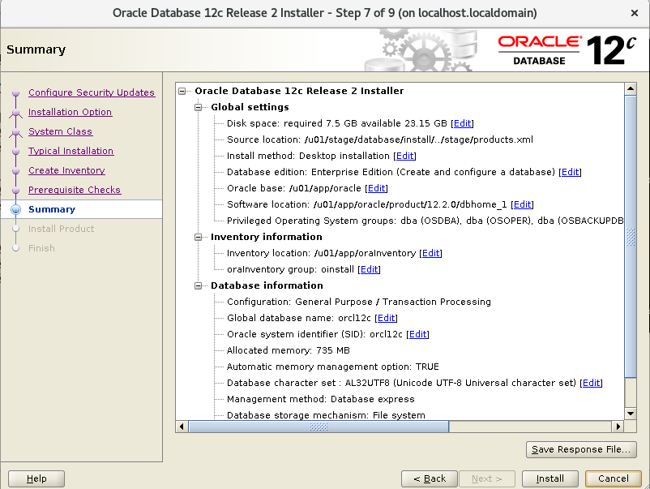
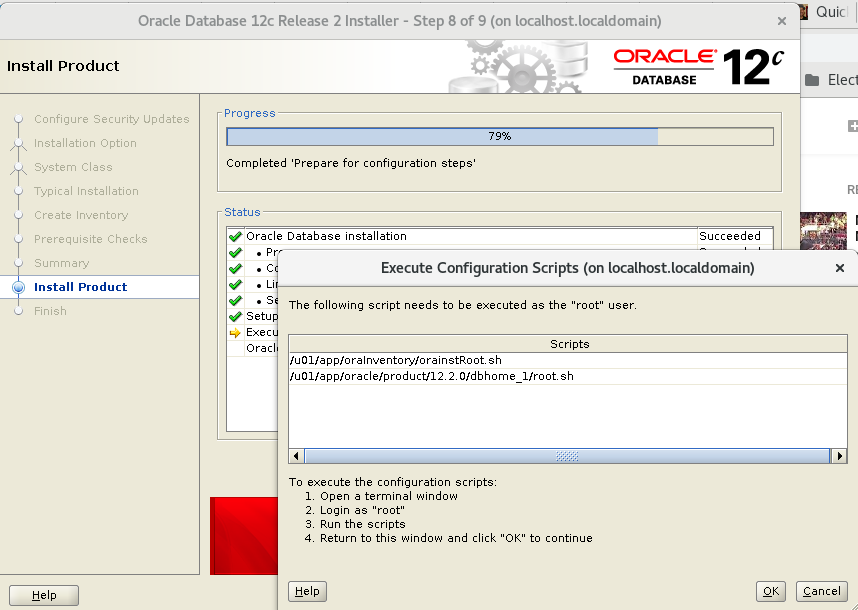

Descargar el archivo desde la pagina oficial de Oracle y estar muy pendiente de hacer el cksum 

# cksum linuxx64_12201_database.zip 
4170261901 3453696911 linuxx64_12201_database.zip

linuxx64_12201_database.zip

# groupadd oinstall
# groupadd dba
# useradd -g oinstall -G dba oracle

# id oracle
uid=1000(oracle) gid=54321(oinstall) grupos=54321(oinstall),54322(dba)

# passwd oracle

# vi /etc/sysctl.conf file.

fs.aio-max-nr = 1048576
fs.file-max = 6815744
kernel.shmall = 2097152
kernel.shmmax = 8329226240
kernel.shmmni = 4096
kernel.sem = 250 32000 100 128
net.ipv4.ip_local_port_range = 9000 65500
net.core.rmem_default = 262144
net.core.rmem_max = 4194304
net.core.wmem_default = 262144
net.core.wmem_max = 1048586

# sysctl -p
# sysctl -a

# vi /etc/security/limits.conf

oracle soft stack 10240
oracle soft nproc 2047
oracle hard nproc 16384
oracle soft nofile 1024
oracle hard nofile 65536

# mkdir  stage

# unzip linuxx64_12201_database.zip -d /stage/
# chown -R oracle:oinstall /stage/

# mkdir /u01
# mkdir /u02
# chown -R oracle:oinstall /u01
# chown -R oracle:oinstall /u02
# chmod -R 775 /u01
# chmod -R 775 /u02
# chmod g+s /u01
# chmod g+s /u02

# yum install -y xorg-x11-server-Xorg.x86_64 xorg-x11-xauth xorg-x11-apps.x86_64

# grep X11Forwarding /etc/ssh/sshd_config 
X11Forwarding yes

$ ssh -X oracle@192.168.0.21
oracle@192.168.0.21's password: 
Last login: Thu Oct  4 15:38:30 2018
/usr/bin/xauth:  file /home/oracle/.Xauthority does not exist

$ export LANG=en_US.utf8 LC_ALL=en_US.utf8

$ /stage/database/runInstaller
Starting Oracle Universal Installer...

Checking Temp space: must be greater than 500 MB.   Actual 30389 MB    Passed
Checking swap space: must be greater than 150 MB.   Actual 3815 MB    Passed
Checking monitor: must be configured to display at least 256 colors
    >>> Could not execute auto check for display colors using command /usr/bin/xdpyinfo. Check if the DISPLAY variable is set.    Failed <<<<

Some requirement checks failed. You must fulfill these requirements before

continuing with the installation,

Continue? (y/n) [n] y

Starting Oracle Universal Installer...

Checking Temp space: must be greater than 500 MB.   Actual 30389 MB    Passed
Checking swap space: must be greater than 150 MB.   Actual 3815 MB    Passed
Checking monitor: must be configured to display at least 256 colors
    >>> Could not execute auto check for display colors using command /usr/bin/xdpyinfo. Check if the DISPLAY variable is set.    Failed <<<<

Some requirement checks failed. You must fulfill these requirements before

continuing with the installation,

Continue? (y/n) [n] 

>>> Ignorando fallos de requisitos necesarios. Continuando...
Preparando para iniciar Oracle Universal Installer desde /tmp/OraInstall2018-10-04_03-40-33PM. Espere...

 Select the following options for basic configuration.

Oracle base: /u01/app/oracle
Software location: /u01/app/oracle/product/12.1.0/dbhome_1
Database file location: /u01
OSDBA group: dba
Global database name: your choice. We chose orcl12c here.
Take note of the password, as you will be using it when you first connect to the database.
Uncheck Create as Container database.

.. figure:: ../images/01.png

.. figure:: ../images/02.png

.. figure:: ../images/04.png

.. figure:: ../images/06.png

.. figure:: ../images/07.png

.. figure:: ../images/08.png

Esto es excelente, si aun nos faltan dependencia, Oracle siempre nos lo indicara y la acción.

.. figure:: ../images/11.png

.. figure:: ../images/13.png

.. figure:: ../images/14.png

Es posible que en este punto nos solicite ejecutar el script por si falta algun pre requisito

.. figure:: ../images/15.png

Instalamos el paquete que falta y luego continuamos, le decimos que vuelva a verificar.::

	# yum install -y smartmontools.x86_64

.. figure:: ../images/13.png

.. figure:: ../images/14.png

