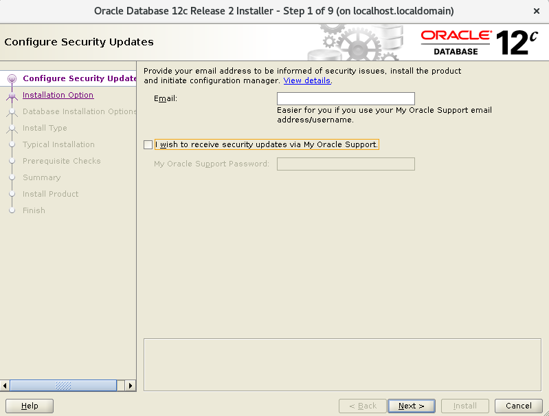
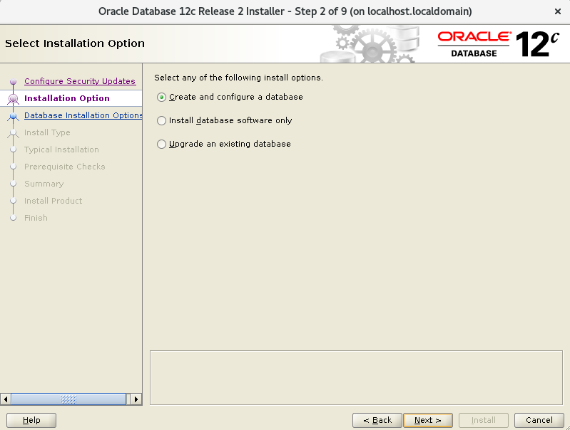
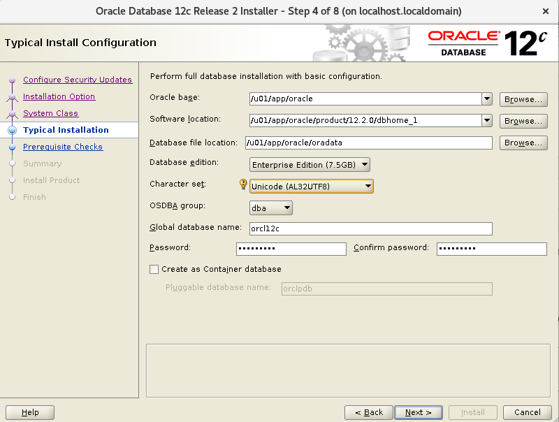
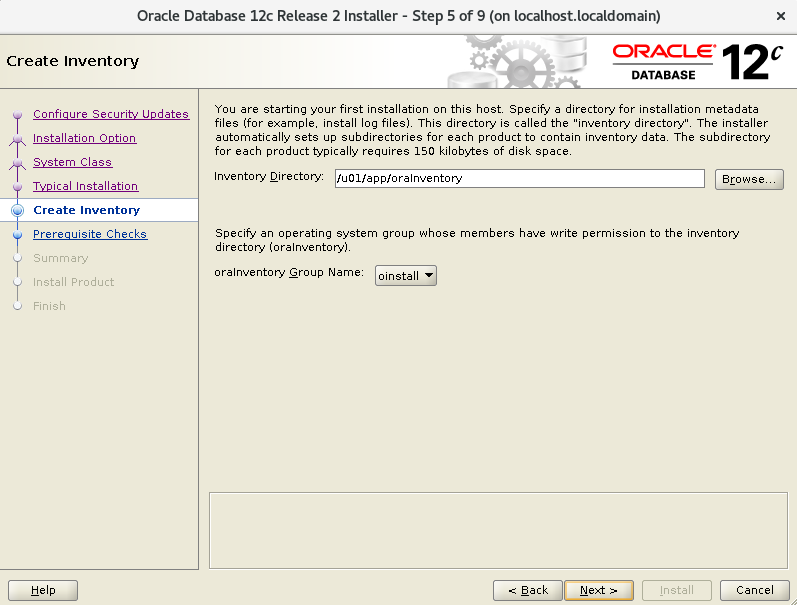
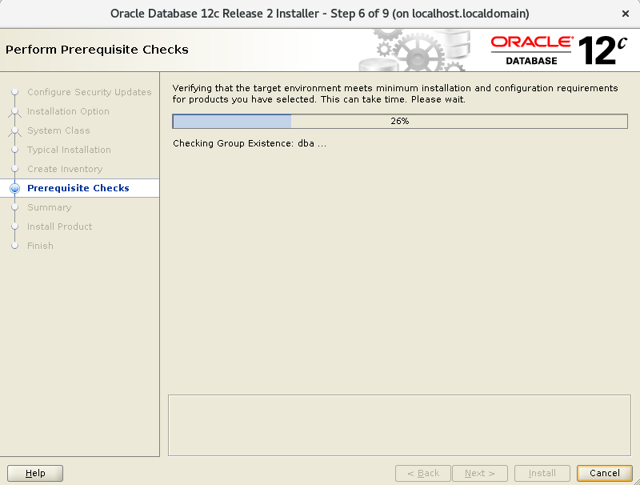
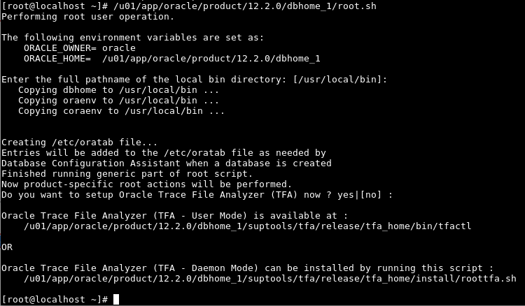
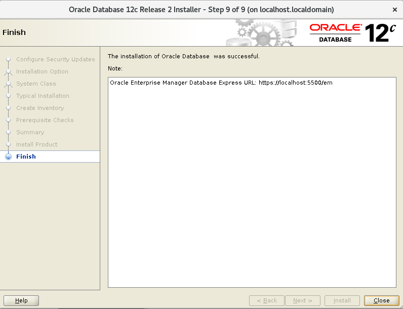

Instalar Oracle 12c en CentOS 7.5
===================================

Este es el paquete que descargamos "linuxx64_12201_database.zip" desde la pagina oficial de Oracle y estar muy pendiente de hacer el cksum. Este debe coincidir con el que esta publicado en la pagina oficial::

	# cksum linuxx64_12201_database.zip 
	4170261901 3453696911 linuxx64_12201_database.zip

Vamos a cumplir todos los requisitos que están publicados en la pagina oficial de Oracle, vamos a seguir los pasos que están ahí publicados.

https://docs.oracle.com/database/121/LTDQI/toc.htm#CEGHFFGG

Actualizamos completamente el SO.::

	# yum -y update

Consultamos el kernel y versión del SO.::

	# uname -a
	Linux localhost.localdomain 3.10.0-862.14.4.el7.x86_64 #1 SMP Wed Sep 26 15:12:11 UTC 2018 x86_64 x86_64 x86_64 GNU/Linux

	# uname -m
	x86_64

	# cat /etc/redhat-release 
	CentOS Linux release 7.5.1804 (Core)

Chequear las configuraciones de Hardware y Memoria del equipo.::

	# grep MemTotal /proc/meminfo
	MemTotal:        1882804 kB

La memoria swap debe ser mayor a 2 Gb, pero en el documento de pre-requisitos explica como configurarla según la cantidad de memoria física que se tenga.::

	# grep SwapTotal /proc/meminfo
	SwapTotal:       3144700 kB

Requiere /tmp como un minimo de 1Gb.::

	# df -h /tmp
	S.ficheros              Tamaño Usados  Disp Uso% Montado en
	/dev/mapper/centos-tmp   1G   120K  900K  90% /tmp

Verificamos los filesystem en donde se instalara en este caso "u01".::

	# df -h 
	S.ficheros              Tamaño Usados  Disp Uso% Montado en
	/dev/mapper/centos-root   8,5G   1,3G  7,2G  15% /
	devtmpfs                  908M      0  908M   0% /dev
	tmpfs                     920M      0  920M   0% /dev/shm
	tmpfs                     920M   8,5M  911M   1% /run
	tmpfs                     920M      0  920M   0% /sys/fs/cgroup
	/dev/sdc1                  30G    33M   30G   1% /u01
	/dev/sda1                 497M   165M  333M  34% /boot
	tmpfs                     184M      0  184M   0% /run/user/0

Verificamos memoria y el swap.::

	# free -h
		      total        used        free      shared  buff/cache   available
	Mem:           1,8G         89M        1,5G        8,4M        167M        1,6G
	Swap:          3,0G          0B        3,0G

Instalamos los siguiente paquetes que son necesarios y están indicados en el Link oficial.::

	# yum install binutils.x86_64 \
	compat-libcap1.x86_64  \
	compat-libstdc++-33.i686 \
	compat-libstdc++-33.x86_64 \
	gcc.x86_64  \
	gcc-c++.x86_64  \
	glibc.i686  \
	glibc.x86_64  \
	glibc-devel.i686  \
	glibc-devel.x86_64  \
	ksh \
	libaio.i686  \
	libaio.x86_64  \
	libaio-devel.i686  \
	libaio-devel.x86_64  \
	libgcc.i686  \
	libgcc.x86_64  \
	libstdc++.i686  \
	libstdc++.x86_64  \
	libstdc++.i686  \
	libstdc++.x86_64  \
	libXi.i686  \
	libXi.x86_64  \
	libXtst.i686  \
	libXtst.x86_64  \
	make.x86_64  \
	sysstat.x86_64 \
	unzip

Instalamos un mínimo de las X11 porque son requeridas para la instalación gráfica de Oracle 12c.::

	# yum install -y xorg-x11-server-Xorg.x86_64 xorg-x11-xauth xorg-x11-apps.x86_64

Nos aseguramos que el ssh permita el forwarding de las X11.::

	# grep X11Forwarding /etc/ssh/sshd_config 
	X11Forwarding yes

Creamos los grupos y usuario requeridos para la instalación de Oracle 12c.::

	# groupadd oinstall
	# groupadd dba
	# useradd -g oinstall -G dba oracle

	# id oracle
	uid=1000(oracle) gid=54321(oinstall) grupos=54321(oinstall),54322(dba)

	# passwd oracle

Configurando los Parámetros del Kernel y Resource Limits.::

	# vi /etc/sysctl.conf file.

	fs.aio-max-nr = 1048576
	fs.file-max = 6815744
	kernel.shmall = 2097152
	kernel.shmmax = 8329226240
	kernel.shmmni = 4096
	kernel.sem = 250 32000 100 128
	net.ipv4.ip_local_port_range = 9000 65500
	net.core.rmem_default = 262144
	net.core.rmem_max = 4194304
	net.core.wmem_default = 262144
	net.core.wmem_max = 1048586

Ejecutamos los siguientes comandos, para aplicar los cambios.::

	# sysctl -p
	# sysctl -a

Chequeamos los Resource Limits para el usuario oracle.::

	# vi /etc/security/limits.conf

	# For File descriptor setting
	oracle          soft    nofile         4096
	oracle          hard    nofile         65536
	# For Number of proccess
	oracle          soft    nproc          2047
	oracle          hard    nproc          16384
	# For Stack
	oracle          soft    stack          10240
	oracle          hard    stack          32768 

Hacemos inicio de sesión con el usuario oracle y verificamos.::

	$ ulimit -Sn
	4096
	$ ulimit -Hn
	65536

	$ ulimit -Su
	2047
	$ ulimit -Hu
	16384

	$ ulimit -Ss
	10240
	$ ulimit -Hs
	32768

Creamos los directorios requeridos.::

	# mkdir -p /u01/app/
	# mkdir -p /u01/installer
	# chown -R oracle:oinstall /u01/app/
	# chmod -R 775 /u01/app/

Instalando Oracle 12c R2
+++++++++++++++++++++++++

Iniciamos sesión con el usuario oracle y que haga el forwarding de las X11.::

	$ ssh -X oracle@192.168.0.21
	oracle@192.168.0.21's password: 
	Last login: Thu Oct  4 15:38:30 2018
	/usr/bin/xauth:  file /home/oracle/.Xauthority does not exist

Descomprimimos el instalador descargado.::

	$ unzip linuxx64_12201_database.zip -d /u01/installer/

Configuramos la variables de locale para el idioma en Ingles.::

	$ export LANG=en_US.utf8 LC_ALL=en_US.utf8

Ejecutamos el proceso de instalación de Oracle 12c.::

	$ /u01/installer/database/runInstaller
	Starting Oracle Universal Installer...

	Checking Temp space: must be greater than 500 MB.   Actual 7242 MB    Passed
	Checking swap space: must be greater than 150 MB.   Actual 3070 MB    Passed
	Checking monitor: must be configured to display at least 256 colors
	    >>> Could not execute auto check for display colors using command /usr/bin/xdpyinfo. Check if the DISPLAY variable is set.    Failed <<<<

	Some requirement checks failed. You must fulfill these requirements before

	continuing with the installation,

	Continue? (y/n) [n] y

	>>> Ignoring required pre-requisite failures. Continuing...
	Preparing to launch Oracle Universal Installer from /tmp/OraInstall2018-10-08_11-24-17AM. Please wait ...[oracle@localhost]

Seleccionamos las siguientes opciones para una configuración Básica.

	Oracle base: /u01/app/oracle
	Software location: /u01/app/oracle/product/12.2.0/dbhome_1
	Database file location: /u01/app/oracle/oradata
	Database edition: Enterprise Edition (7.5Gb)
	Character set: Unicode (AL32UTF8)
	OSDBA group: dba
	Global database name: orcl12c
	Password: America21
	Create as Container database: Uncheck

.. figure:: ../images/01.png

.. figure:: ../images/03.png

.. figure:: ../images/05.png

Esto es excelente, si aun nos faltan paquetes o configurracines, Oracle siempre nos lo indicara y las acciones a tomar.

.. figure:: ../images/09.png

Sin salirnos de la instalación instalamos los componentes faltantes.:: 

	# yum install -y smartmontools

Pulsamos en el botón "check again" y ya debe estar listo y podemos continuar.

.. figure:: ../images/10.png

Es posible que en este punto nos solicite ejecutar los scripts para culminar los pre-requisito

.. figure:: ../images/12.png

Nos vamos nuevamente a un terminal con **root** y ejecutamos los script que nos indicaron.::

	# /u01/app/oraInventory/orainstRoot.sh
	# /u01/app/oracle/product/12.2.0/dbhome_1/root.sh

Retornamos a la ventana de instalación  y le damos continuar.::

.. figure:: ../images/13.png

Culmina la instalación

Verificamos que los puertos esten en escucha.::

	$ netstat -nat | grep -i listen
	tcp        0      0 127.0.0.1:25            0.0.0.0:*               LISTEN     
	tcp        0      0 127.0.0.1:6010          0.0.0.0:*               LISTEN     
	tcp        0      0 0.0.0.0:22              0.0.0.0:*               LISTEN     
	tcp6       0      0 ::1:25                  :::*                    LISTEN     
	tcp6       0      0 ::1:6010                :::*                    LISTEN     
	tcp6       0      0 :::5500                 :::*                    LISTEN     
	tcp6       0      0 :::11011                :::*                    LISTEN     
	tcp6       0      0 :::1521                 :::*                    LISTEN     
	tcp6       0      0 :::22                   :::*                    LISTEN 

Configuramos las variables de entorno para el usuario oracle.::

	$ cd 

	$ vi .bash_profile

	TMPDIR=$TMP; export TMPDIR
	ORACLE_BASE=/u01/app/oracle; export ORACLE_BASE
	ORACLE_HOME=$ORACLE_BASE/product/12.2.0/dbhome_1; export ORACLE_HOME
	ORACLE_SID=orcl12c; export ORACLE_SID
	PATH=$ORACLE_HOME/bin:$PATH; export PATH
	LD_LIBRARY_PATH=$ORACLE_HOME/lib:/lib:/usr/lib:/usr/lib64; export LD_LIBRARY_PATH
	CLASSPATH=$ORACLE_HOME/jlib:$ORACLE_HOME/rdbms/jlib; export CLASSPATH

	$ source .bash_profile 

Remplazamos el localhost por 0.0.0.0 en el listener.ora.::

	$ vi $ORACLE_HOME/network/admin/listener.ora 

Este.::

	(ADDRESS = (PROTOCOL = TCP)(HOST = localhost)(PORT = 1521))

Por este.::

	(ADDRESS = (PROTOCOL = TCP)(HOST = 0.0.0.0)(PORT = 1521))

El archivo queda así.::

	# listener.ora Network Configuration File: /u01/app/oracle/product/12.2.0/dbhome_1/network/admin/listener.ora
	# Generated by Oracle configuration tools.

	LISTENER =
	  (DESCRIPTION_LIST =
	    (DESCRIPTION =
	      (ADDRESS = (PROTOCOL = TCP)(HOST = localhost)(PORT = 1521))
	      (ADDRESS = (PROTOCOL = IPC)(KEY = EXTPROC1521))
	    )
	  )

Consultamos el Listener y vemos que esta localhost.::

	$ lsnrctl status

	LSNRCTL for Linux: Version 12.2.0.1.0 - Production on 08-OCT-2018 13:29:17

	Copyright (c) 1991, 2016, Oracle.  All rights reserved.

	Connecting to (DESCRIPTION=(ADDRESS=(PROTOCOL=TCP)(HOST=localhost)(PORT=1521)))
	STATUS of the LISTENER
	------------------------
	Alias                     LISTENER
	Version                   TNSLSNR for Linux: Version 12.2.0.1.0 - Production
	Start Date                08-OCT-2018 13:28:37
	Uptime                    0 days 0 hr. 0 min. 39 sec
	Trace Level               off
	Security                  ON: Local OS Authentication
	SNMP                      OFF
	Listener Parameter File   /u01/app/oracle/product/12.2.0/dbhome_1/network/admin/listener.ora
	Listener Log File         /u01/app/oracle/diag/tnslsnr/localhost/listener/alert/log.xml
	Listening Endpoints Summary...
	  (DESCRIPTION=(ADDRESS=(PROTOCOL=tcp)(HOST=localhost)(PORT=1521)))
	  (DESCRIPTION=(ADDRESS=(PROTOCOL=ipc)(KEY=EXTPROC1521)))
	  (DESCRIPTION=(ADDRESS=(PROTOCOL=tcps)(HOST=localhost)(PORT=5500))(Security=(my_wallet_directory=/u01/app/oracle/admin/orcl12c/xdb_wallet))(Presentation=HTTP)(Session=RAW))
	Services Summary...
	Service "orcl12c" has 1 instance(s).
	  Instance "orcl12c", status READY, has 1 handler(s) for this service...
	Service "orcl12cXDB" has 1 instance(s).
	  Instance "orcl12c", status READY, has 1 handler(s) for this service...
	The command completed successfully

Debemos detenerlo.::

	$ lsnrctl stop

	LSNRCTL for Linux: Version 12.2.0.1.0 - Production on 08-OCT-2018 13:28:01

	Copyright (c) 1991, 2016, Oracle.  All rights reserved.

	Connecting to (DESCRIPTION=(ADDRESS=(PROTOCOL=TCP)(HOST=localhost)(PORT=1521)))
	The command completed successfully

Lo iniciamos nuevamente.::

	$ lsnrctl start

	LSNRCTL for Linux: Version 12.2.0.1.0 - Production on 08-OCT-2018 13:28:37

	Copyright (c) 1991, 2016, Oracle.  All rights reserved.

	Starting /u01/app/oracle/product/12.2.0/dbhome_1/bin/tnslsnr: please wait...

	TNSLSNR for Linux: Version 12.2.0.1.0 - Production
	System parameter file is /u01/app/oracle/product/12.2.0/dbhome_1/network/admin/listener.ora
	Log messages written to /u01/app/oracle/diag/tnslsnr/localhost/listener/alert/log.xml
	Listening on: (DESCRIPTION=(ADDRESS=(PROTOCOL=tcp)(HOST=localhost)(PORT=1521)))
	Listening on: (DESCRIPTION=(ADDRESS=(PROTOCOL=ipc)(KEY=EXTPROC1521)))

	Connecting to (DESCRIPTION=(ADDRESS=(PROTOCOL=TCP)(HOST=localhost)(PORT=1521)))
	STATUS of the LISTENER
	------------------------
	Alias                     LISTENER
	Version                   TNSLSNR for Linux: Version 12.2.0.1.0 - Production
	Start Date                08-OCT-2018 13:28:37
	Uptime                    0 days 0 hr. 0 min. 0 sec
	Trace Level               off
	Security                  ON: Local OS Authentication
	SNMP                      OFF
	Listener Parameter File   /u01/app/oracle/product/12.2.0/dbhome_1/network/admin/listener.ora
	Listener Log File         /u01/app/oracle/diag/tnslsnr/localhost/listener/alert/log.xml
	Listening Endpoints Summary...
	  (DESCRIPTION=(ADDRESS=(PROTOCOL=tcp)(HOST=0.0.0.0)(PORT=1521)))
	  (DESCRIPTION=(ADDRESS=(PROTOCOL=ipc)(KEY=EXTPROC1521)))
	The listener supports no services
	The command completed successfully

Debemos esperar un rato y consultar nuevamente.::

	$ lsnrctl status

	LSNRCTL for Linux: Version 12.2.0.1.0 - Production on 08-OCT-2018 13:29:17

	Copyright (c) 1991, 2016, Oracle.  All rights reserved.

	Connecting to (DESCRIPTION=(ADDRESS=(PROTOCOL=TCP)(HOST=0.0.0.0)(PORT=1521)))
	STATUS of the LISTENER
	------------------------
	Alias                     LISTENER
	Version                   TNSLSNR for Linux: Version 12.2.0.1.0 - Production
	Start Date                08-OCT-2018 13:28:37
	Uptime                    0 days 0 hr. 0 min. 39 sec
	Trace Level               off
	Security                  ON: Local OS Authentication
	SNMP                      OFF
	Listener Parameter File   /u01/app/oracle/product/12.2.0/dbhome_1/network/admin/listener.ora
	Listener Log File         /u01/app/oracle/diag/tnslsnr/localhost/listener/alert/log.xml
	Listening Endpoints Summary...
	  (DESCRIPTION=(ADDRESS=(PROTOCOL=tcp)(HOST=0.0.0.0)(PORT=1521)))
	  (DESCRIPTION=(ADDRESS=(PROTOCOL=ipc)(KEY=EXTPROC1521)))
	  (DESCRIPTION=(ADDRESS=(PROTOCOL=tcps)(HOST=localhost)(PORT=5500))(Security=(my_wallet_directory=/u01/app/oracle/admin/orcl12c/xdb_wallet))(Presentation=HTTP)(Session=RAW))
	Services Summary...
	Service "orcl12c" has 1 instance(s).
	  Instance "orcl12c", status READY, has 1 handler(s) for this service...
	Service "orcl12cXDB" has 1 instance(s).
	  Instance "orcl12c", status READY, has 1 handler(s) for this service...
	The command completed successfully

Ya podemos ingresar a la Base de Datos con el usuario system y con la clave que configuramos en el inicio de la instalación.::

	$ sqlplus system@orcl12c

	SQL*Plus: Release 12.2.0.1.0 Production on Mon Oct 8 13:33:26 2018

	Copyright (c) 1982, 2016, Oracle.  All rights reserved.

	Enter password: 

	Connected to:
	Oracle Database 12c Enterprise Edition Release 12.2.0.1.0 - 64bit Production

	SQL> 

