Instalar Oracle 12c solo los binarios en CentOS 7.5
===================================================

Este es el paquete que descargamos "linuxx64_12201_database.zip" desde la pagina oficial de Oracle y estar muy pendiente de hacer el cksum. Este debe coincidir con el que esta publicado en la pagina oficial::

	# cksum linuxx64_12201_database.zip 
	4170261901 3453696911 linuxx64_12201_database.zip

Vamos a cumplir todos los requisitos que están publicados en la pagina oficial de Oracle, vamos a seguir los pasos que están ahí publicados.

https://docs.oracle.com/database/121/LTDQI/toc.htm#CEGHFFGG

Actualizamos completamente el SO.::

	# yum -y update

Consultamos el kernel y versión del SO.::

	# uname -a
	Linux localhost.localdomain 3.10.0-862.14.4.el7.x86_64 #1 SMP Wed Sep 26 15:12:11 UTC 2018 x86_64 x86_64 x86_64 GNU/Linux

	# uname -m
	x86_64

	# cat /etc/redhat-release 
	CentOS Linux release 7.5.1804 (Core)

Chequear las configuraciones de Hardware y Memoria del equipo.::

	# grep MemTotal /proc/meminfo
	MemTotal:        1882804 kB

La memoria swap debe ser mayor a 2 Gb, pero en el documento de pre-requisitos explica como configurarla según la cantidad de memoria física que se tenga.::

	# grep SwapTotal /proc/meminfo
	SwapTotal:       3144700 kB

Requiere /tmp como un minimo de 1Gb.::

	# df -h /tmp
	S.ficheros              Tamaño Usados  Disp Uso% Montado en
	/dev/mapper/centos-tmp   1G   120K  900K  90% /tmp

Verificamos los filesystem en donde se instalara en este caso "u01".::

	# df -h 
	S.ficheros              Tamaño Usados  Disp Uso% Montado en
	/dev/mapper/centos-root   8,5G   1,3G  7,2G  15% /
	devtmpfs                  908M      0  908M   0% /dev
	tmpfs                     920M      0  920M   0% /dev/shm
	tmpfs                     920M   8,5M  911M   1% /run
	tmpfs                     920M      0  920M   0% /sys/fs/cgroup
	/dev/sdc1                  30G    33M   30G   1% /u01
	/dev/sda1                 497M   165M  333M  34% /boot
	tmpfs                     184M      0  184M   0% /run/user/0

Verificamos memoria y el swap.::

	# free -h
		      total        used        free      shared  buff/cache   available
	Mem:           1,8G         89M        1,5G        8,4M        167M        1,6G
	Swap:          3,0G          0B        3,0G

Instalamos los siguiente paquetes que son necesarios y están indicados en el Link oficial.::

	# yum install binutils.x86_64 \
	compat-libcap1.x86_64  \
	compat-libstdc++-33.i686 \
	compat-libstdc++-33.x86_64 \
	gcc.x86_64  \
	gcc-c++.x86_64  \
	glibc.i686  \
	glibc.x86_64  \
	glibc-devel.i686  \
	glibc-devel.x86_64  \
	ksh \
	libaio.i686  \
	libaio.x86_64  \
	libaio-devel.i686  \
	libaio-devel.x86_64  \
	libgcc.i686  \
	libgcc.x86_64  \
	libstdc++.i686  \
	libstdc++.x86_64  \
	libstdc++.i686  \
	libstdc++.x86_64  \
	libXi.i686  \
	libXi.x86_64  \
	libXtst.i686  \
	libXtst.x86_64  \
	make.x86_64  \
	sysstat.x86_64 \
	unzip

Instalamos un mínimo de las X11 porque son requeridas para la instalación gráfica de Oracle 12c.::

	# yum install -y xorg-x11-server-Xorg.x86_64 xorg-x11-xauth xorg-x11-apps.x86_64

Nos aseguramos que el ssh permita el forwarding de las X11.::

	# grep X11Forwarding /etc/ssh/sshd_config 
	X11Forwarding yes

Creamos los grupos y usuario requeridos para la instalación de Oracle 12c.::

	# groupadd oinstall
	# groupadd dba
	# useradd -g oinstall -G dba oracle

	# id oracle
	uid=1000(oracle) gid=54321(oinstall) grupos=54321(oinstall),54322(dba)

	# passwd oracle

Configurando los Parámetros del Kernel y Resource Limits.::

	# vi /etc/sysctl.conf file.

	fs.aio-max-nr = 1048576
	fs.file-max = 6815744
	kernel.shmall = 2097152
	kernel.shmmax = 8329226240
	kernel.shmmni = 4096
	kernel.sem = 250 32000 100 128
	net.ipv4.ip_local_port_range = 9000 65500
	net.core.rmem_default = 262144
	net.core.rmem_max = 4194304
	net.core.wmem_default = 262144
	net.core.wmem_max = 1048586

Ejecutamos los siguientes comandos, para aplicar los cambios.::

	# sysctl -p
	# sysctl -a

Chequeamos los Resource Limits para el usuario oracle.::

	# vi /etc/security/limits.conf

	# For File descriptor setting
	oracle          soft    nofile         4096
	oracle          hard    nofile         65536
	# For Number of proccess
	oracle          soft    nproc          2047
	oracle          hard    nproc          16384
	# For Stack
	oracle          soft    stack          10240
	oracle          hard    stack          32768 

Hacemos inicio de sesión con el usuario oracle y verificamos.::

	$ ulimit -Sn
	4096
	$ ulimit -Hn
	65536

	$ ulimit -Su
	2047
	$ ulimit -Hu
	16384

	$ ulimit -Ss
	10240
	$ ulimit -Hs
	32768

Creamos los directorios requeridos.::

	# mkdir -p /u01/app/
	# mkdir -p /u01/installer
	# chown -R oracle:oinstall /u01/app/
	# chmod -R 775 /u01/app/

Instalando Oracle 12c R2
+++++++++++++++++++++++++

Iniciamos sesión con el usuario oracle y que haga el forwarding de las X11.::

	$ ssh -X oracle@192.168.0.21
	oracle@192.168.0.21's password: 
	Last login: Thu Oct  4 15:38:30 2018
	/usr/bin/xauth:  file /home/oracle/.Xauthority does not exist

Descomprimimos el instalador descargado.::

	$ unzip linuxx64_12201_database.zip -d /u01/installer/

Configuramos la variables de locale para el idioma en Ingles.::

	$ export LANG=en_US.utf8 LC_ALL=en_US.utf8

Ejecutamos el proceso de instalación de Oracle 12c.::

	$ /u01/installer/database/runInstaller
	Starting Oracle Universal Installer...

	Checking Temp space: must be greater than 500 MB.   Actual 7242 MB    Passed
	Checking swap space: must be greater than 150 MB.   Actual 3070 MB    Passed
	Checking monitor: must be configured to display at least 256 colors
	    >>> Could not execute auto check for display colors using command /usr/bin/xdpyinfo. Check if the DISPLAY variable is set.    Failed <<<<

	Some requirement checks failed. You must fulfill these requirements before

	continuing with the installation,

	Continue? (y/n) [n] y

	>>> Ignoring required pre-requisite failures. Continuing...
	Preparing to launch Oracle Universal Installer from /tmp/OraInstall2018-10-08_11-24-17AM. Please wait ...[oracle@localhost]

Seleccionamos las siguientes opciones para una configuración Básica.

	Oracle base: /u01/app/oracle
	Software location: /u01/app/oracle/product/12.2.0/dbhome_1
	Database file location: /u01/app/oracle/oradata
	Database edition: Enterprise Edition (7.5Gb)
	Character set: Unicode (AL32UTF8)
	OSDBA group: dba
	Global database name: orcl12c
	Password: America21
	Create as Container database: Uncheck

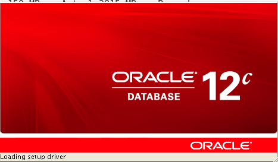

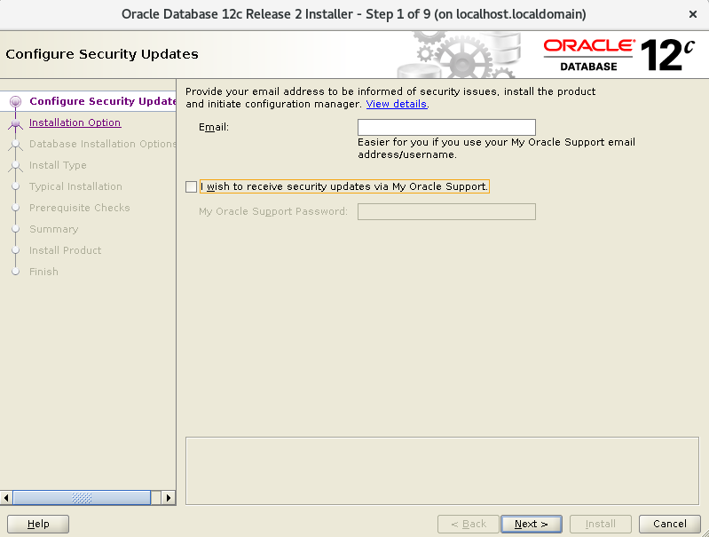

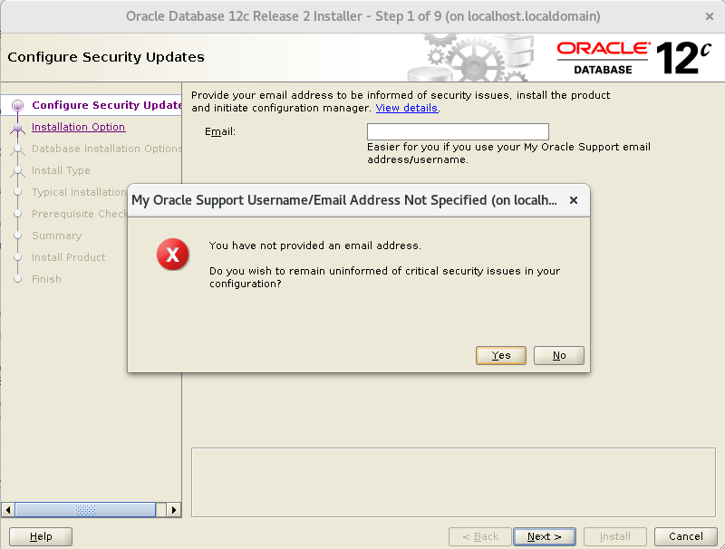

.. figure:: ../images/04.png

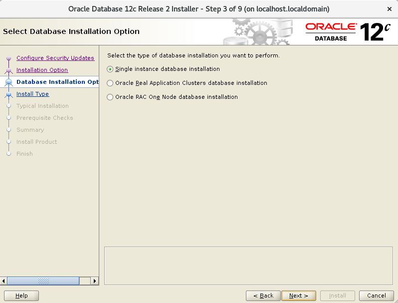

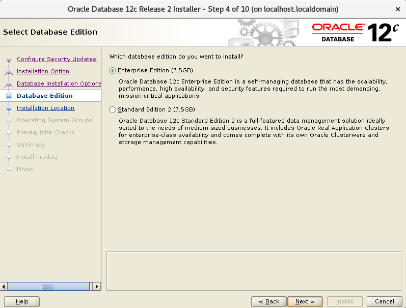

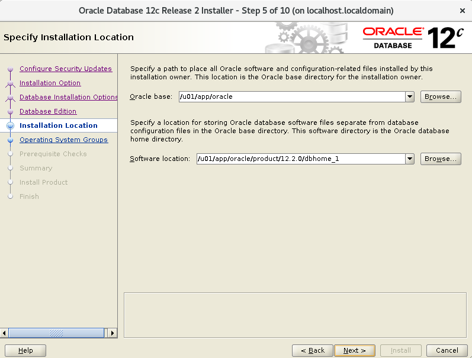

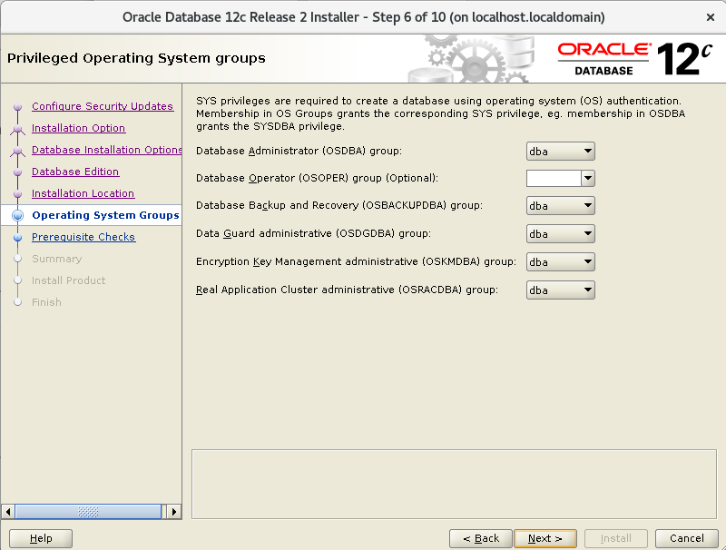

Esto es excelente, si aun nos faltan paquetes o configurracines, Oracle siempre nos lo indicara y las acciones a tomar.

.. figure:: ../images/09.png

Sin salirnos de la instalación instalamos los componentes faltantes.:: 

	# yum install -y smartmontools

Pulsamos en el botón "check again" y ya debe estar listo y podemos continuar.

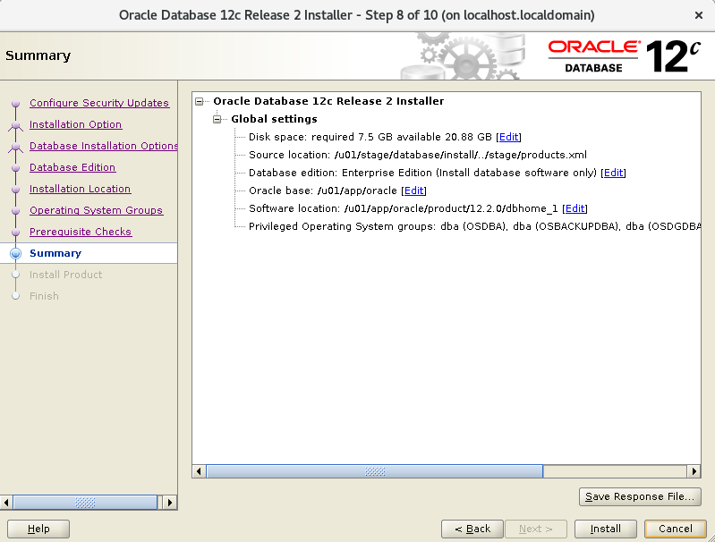

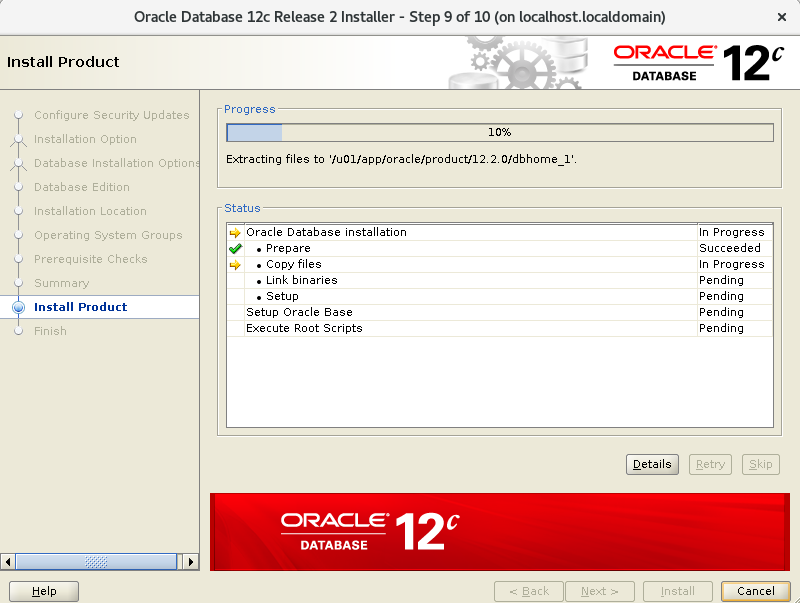

Es posible que en este punto nos solicite ejecutar los scripts para culminar los pre-requisito

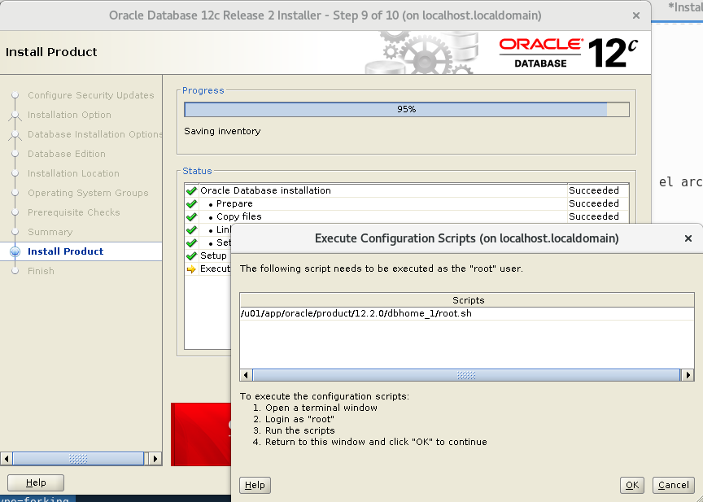

Nos vamos nuevamente a un terminal con **root** y ejecutamos los script que nos indicaron.::

	# /u01/app/oraInventory/orainstRoot.sh
	# /u01/app/oracle/product/12.2.0/dbhome_1/root.sh

Retornamos a la ventana de instalación  y le damos continuar.::

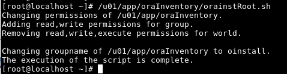

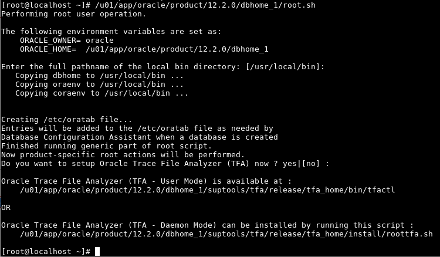

Culmina la instalación

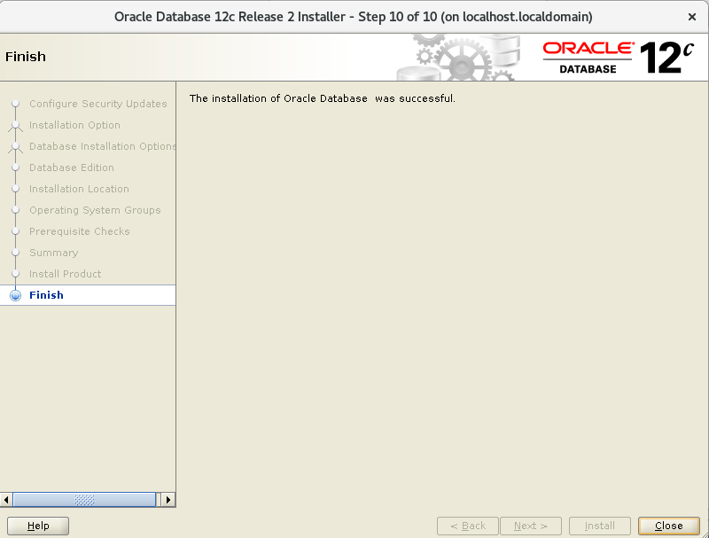

Specify an Instance Identifier (SID)
++++++++++++++++++++++++++++++++++++++

Decide on a unique Oracle system identifier (SID) for your instance, open a command window, and set the ORACLE_SID environment variable. Use this command windows for the subsequent steps.

ORACLE_SID is used to distinguish this instance from other Oracle Database instances that you may create later and run concurrently on the same host computer. The maximum number of characters for ORACLE_SID is 12, and only letters and numeric digits are permitted. On some platforms, the SID is case-sensitive.

	ORACLE_SID=mynewdb
	export ORACLE_SID

Ensure That the Required Environment Variables Are Set
++++++++++++++++++++++++++++++++++++++++++++++++++++++++

Depending on your platform, before you can start SQL*Plus (as required in Step 6: Connect to the Instance), you may have to set environment variables, or at least verify that they are set properly.

For example, on most platforms, ORACLE_SID and ORACLE_HOME must be set. In addition, it is advisable to set the PATH variable to include the ORACLE_HOME/bin directory. On the UNIX and Linux platforms, you must set these environment variables manually. On the Windows platform, OUI automatically assigns values to ORACLE_HOME and ORACLE_SID in the Windows registry. If you did not create a database upon installation, OUI does not set ORACLE_SID in the registry, and you will have to set the ORACLE_SID environment variable when you create your database later.:_

	export ORACLE_BASE=/u01/app/oracle
	export ORACLE_HOME=/u01/app/oracle/product/11.2.0
	export ORACLE_SID=mynewdb

Choose a Database Administrator Authentication Method
+++++++++++++++++++++++++++++++++++++++++++++++++++++++++

You must be authenticated and granted appropriate system privileges in order to create a database. You can authenticate as an administrator with the required privileges in the following ways:

	With a password file

	With operating system authentication

In this step, you decide on an authentication method.

If you decide to authenticate with a password file, create the password file as described in "Creating and Maintaining a Password File". If you decide to authenticate with operating system authentication, ensure that you log in to the host computer with a user account that is a member of the appropriate operating system user group. On the UNIX and Linux platforms, for example, this is typically the dba user group. On the Windows platform, the user installing the Oracle software is automatically placed in the required user group

See Also:
https://docs.oracle.com/cd/B28359_01/server.111/b28310/dba007.htm#ADMIN11059

Create the Initialization Parameter File

When an Oracle instance starts, it reads an initialization parameter file. This file can be a text file, which can be created and modified with a text editor, or a binary file, which is created and dynamically modified by the database. The binary file, which is preferred, is called a server parameter file. In this step, you create a text initialization parameter file. In a later step, you create a server parameter file from the text file.

One way to create the text initialization parameter file is to edit the sample presented in "Sample Initialization Parameter File - https://docs.oracle.com/cd/B28359_01/server.111/b28310/create005.htm#CIAGFFIE".

For convenience, store your initialization parameter file in the Oracle Database default location, using the default file name. Then when you start your database, it will not be necessary to specify the PFILE clause of the STARTUP command, because Oracle Database automatically looks in the default location for the initialization parameter file.

For more information about initialization parameters and the initialization parameter file, including the default name and location of the initialization parameter file for your platform, see "About Initialization Parameters and Initialization Parameter Files".::

	$ cp $ORACLE_HOME/dbs/init.ora $ORACLE_HOME/dbs/initmynewdb.ora

	$ vi $ORACLE_HOME/dbs/initmynewdb.ora

	db_name='mynewdb'
	memory_target=800M
	processes = 150
	audit_file_dest='$ORACLE_BASE/admin/mynewdb/adump'
	audit_trail ='db'
	db_block_size=8192
	db_domain=''
	db_recovery_file_dest='$ORACLE_BASE/fast_recovery_area'
	db_recovery_file_dest_size=2G
	diagnostic_dest='$ORACLE_BASE'
	dispatchers='(PROTOCOL=TCP) (SERVICE=ORCLXDB)'
	open_cursors=300 
	remote_login_passwordfile='EXCLUSIVE'
	undo_tablespace='UNDOTBS1'
	# You may want to ensure that control files are created on separate physical
	# devices
	control_files = (ora_control1, ora_control2)
	compatible ='11.2.0'

	$ mkdir -p $ORACLE_BASE/admin/mynewdb/adump

	$ mkdir -p $ORACLE_BASE/fast_recovery_area

Connect to the Instance
++++++++++++++++++++++++++

Start SQL*Plus and connect to your Oracle Database instance with the SYSDBA system privilege.

To authenticate with a password file, enter the following commands, and then enter the SYS password when prompted::

	$ sqlplus /nolog
	SQL> CONNECT SYS AS SYSDBA

To authenticate with operating system authentication, enter the following commands::

	$ sqlplus /nolog
	SQL> CONNECT / AS SYSDBA

SQL*Plus outputs the following message::

	Connected to an idle instance.

Create a Server Parameter File
+++++++++++++++++++++++++++++++++

The server parameter file enables you to change initialization parameters with the ALTER SYSTEM command and persist the changes across a database shutdown and startup. You create the server parameter file from your edited text initialization file.

The following SQL*Plus command reads the text initialization parameter file (PFILE) with the default name from the default location, creates a server parameter file (SPFILE) from the text initialization parameter file, and writes the SPFILE to the default location with the default SPFILE name.::

	SQL> CREATE SPFILE FROM PFILE;

	File created.

Start the Instance
+++++++++++++++++++

Start an instance without mounting a database. Typically, you do this only during database creation or while performing maintenance on the database. Use the STARTUP command with the NOMOUNT clause. In this example, because the initialization parameter file or server parameter file is stored in the default location, you are not required to specify the PFILE clause::

	SQL> STARTUP NOMOUNT
	ORACLE instance started.

	Total System Global Area  838860800 bytes
	Fixed Size		    8626240 bytes
	Variable Size		  553652160 bytes
	Database Buffers	  272629760 bytes
	Redo Buffers		    3952640 bytes

At this point, the instance memory is allocated and its processes are started. The database itself does not yet exist.

 Issue the CREATE DATABASE Statement
+++++++++++++++++++++++++++++++++++++

To create the new database, use the CREATE DATABASE statement.

Example 1

The following statement creates database mynewdb. This database name must agree with the DB_NAME parameter in the initialization parameter file. This example assumes the following:

	The initialization parameter file specifies the number and location of control files with the CONTROL_FILES parameter.

	The directory /u01/app/oracle/oradata/mynewdb exists.
::

CREATE DATABASE mynewdb
   USER SYS IDENTIFIED BY America21
   USER SYSTEM IDENTIFIED BY America22
   LOGFILE GROUP 1 ('/u01/app/oracle/oradata/mynewdb/redo01.log') SIZE 100M,
           GROUP 2 ('/u01/app/oracle/oradata/mynewdb/redo02.log') SIZE 100M,
           GROUP 3 ('/u01/app/oracle/oradata/mynewdb/redo03.log') SIZE 100M
   MAXLOGFILES 5
   MAXLOGMEMBERS 5
   MAXLOGHISTORY 1
   MAXDATAFILES 100
   CHARACTER SET US7ASCII
   NATIONAL CHARACTER SET AL16UTF16
   EXTENT MANAGEMENT LOCAL
   DATAFILE '/u01/app/oracle/oradata/mynewdb/system01.dbf' SIZE 325M REUSE
   SYSAUX DATAFILE '/u01/app/oracle/oradata/mynewdb/sysaux01.dbf' SIZE 325M REUSE
   DEFAULT TABLESPACE users
      DATAFILE '/u01/app/oracle/oradata/mynewdb/users01.dbf'
      SIZE 500M REUSE AUTOEXTEND ON MAXSIZE UNLIMITED
   DEFAULT TEMPORARY TABLESPACE tempts1
      TEMPFILE '/u01/app/oracle/oradata/mynewdb/temp01.dbf'
      SIZE 20M REUSE
   UNDO TABLESPACE undotbs
      DATAFILE '/u01/app/oracle/oradata/mynewdb/UNDOTBS1.dbf'
      SIZE 200M REUSE AUTOEXTEND ON MAXSIZE UNLIMITED;

A database is created with the following characteristics:

The database is named mynewdb. Its global database name is mynewdb.us.oracle.com, where the domain portion (us.oracle.com) is taken from the initialization file. See "Determining the Global Database Name".

Three control files are created as specified by the CONTROL_FILES initialization parameter, which was set before database creation in the initialization parameter file. See "Sample Initialization Parameter File" and "Specifying Control Files".

The passwords for user accounts SYS and SYSTEM are set to the values that you specified. Beginning with Release 11g, the passwords are case-sensitive. The two clauses that specify the passwords for SYS and SYSTEM are not mandatory in this release of Oracle Database. However, if you specify either clause, you must specify both clauses. For further information about the use of these clauses, see "Protecting Your Database: Specifying Passwords for Users SYS and SYSTEM".

The new database has three redo log files as specified in the LOGFILE clause. MAXLOGFILES, MAXLOGMEMBERS, and MAXLOGHISTORY define limits for the redo log. See Chapter 10, "Managing the Redo Log".

MAXDATAFILES specifies the maximum number of datafiles that can be open in the database. This number affects the initial sizing of the control file.

Note:

You can set several limits during database creation. Some of these limits are limited by and affected by operating system limits. For example, if you set MAXDATAFILES, Oracle Database allocates enough space in the control file to store MAXDATAFILES filenames, even if the database has only one datafile initially. However, because the maximum control file size is limited and operating system dependent, you might not be able to set all CREATE DATABASE parameters at their theoretical maximums.
For more information about setting limits during database creation, see the Oracle Database SQL Language Reference and your operating system–specific Oracle documentation.

The US7ASCII character set is used to store data in this database.

The AL16UTF16 character set is specified as the NATIONAL CHARACTER SET, used to store data in columns specifically defined as NCHAR, NCLOB, or NVARCHAR2.

The SYSTEM tablespace, consisting of the operating system file /u01/app/oracle/oradata/mynewdb/system01.dbf is created as specified by the DATAFILE clause. If a file with that name already exists, it is overwritten.

The SYSTEM tablespace is created as a locally managed tablespace. See "Creating a Locally Managed SYSTEM Tablespace".

A SYSAUX tablespace is created, consisting of the operating system file /u01/app/oracle/oradata/mynewdb/sysaux01.dbf as specified in the SYSAUX DATAFILE clause. See "About the SYSAUX Tablespace".

The DEFAULT TABLESPACE clause creates and names a default permanent tablespace for this database.

The DEFAULT TEMPORARY TABLESPACE clause creates and names a default temporary tablespace for this database. See "Creating a Default Temporary Tablespace".

The UNDO TABLESPACE clause creates and names an undo tablespace that is used to store undo data for this database if you have specified UNDO_MANAGEMENT=AUTO in the initialization parameter file. If you omit this parameter, it defaults to AUTO. See "Using Automatic Undo Management: Creating an Undo Tablespace".

Redo log files will not initially be archived, because the ARCHIVELOG clause is not specified in this CREATE DATABASE statement. This is customary during database creation. You can later use an ALTER DATABASE statement to switch to ARCHIVELOG mode. The initialization parameters in the initialization parameter file for mynewdb relating to archiving are LOG_ARCHIVE_DEST_1 and LOG_ARCHIVE_FORMAT. See Chapter 11, "Managing Archived Redo Logs".

