Instalar Oracle Express 11g en CentOS 7.0
=========================================

SI estas trabando en una Maquina Virtual, reiniciala para que todo este limpio.

Recordemos deshabilitar Selinux y Firewalld.

Instalar los paquetes requeridos.::

	# yum -y install libgcc glibc unzip

Instalar.::

	# ls -l
	total 308492
	-rw-r--r--. 1 root root 315891481 oct  8 16:07 oracle-xe-11.2.0-1.0.x86_64.rpm.zip

.::

	# unzip oracle-xe-11.2.0-1.0.x86_64.rpm.zip

.::

	# ls 
	Disk1  oracle-xe-11.2.0-1.0.x86_64.rpm.zip

	# cd Disk1/

	# ls 
	oracle-xe-11.2.0-1.0.x86_64.rpm  response  upgrade

.::

	# rpm -ivh oracle-xe-11.2.0-1.0.x86_64.rpm 
	Preparando...               ########################################### [100%]
	   1:oracle-xe              ########################################### [100%]
	Executing post-install steps...

	You must run '/etc/init.d/oracle-xe configure' as the root user to configure the database.

.::

	# /etc/init.d/oracle-xe configure

	Oracle Database 11g Express Edition Configuration
	-------------------------------------------------
	This will configure on-boot properties of Oracle Database 11g Express 
	Edition.  The following questions will determine whether the database should 
	be starting upon system boot, the ports it will use, and the passwords that 
	will be used for database accounts.  Press <Enter> to accept the defaults. 
	Ctrl-C will abort.

	Specify the HTTP port that will be used for Oracle Application Express [8080]:

	Specify a port that will be used for the database listener [1521]:

	Specify a password to be used for database accounts.  Note that the same
	password will be used for SYS and SYSTEM.  Oracle recommends the use of 
	different passwords for each database account.  This can be done after 
	initial configuration:Venezuela21
	Confirm the password:Venezuela21

	Do you want Oracle Database 11g Express Edition to be started on boot (y/n) [y]:

	Starting Oracle Net Listener...Done
	Configuring database...Done
	Starting Oracle Database 11g Express Edition instance...Done
	Installation completed successfully.

Realizamos algunas pruebas.::

	# ps -ef | grep pmon
	oracle     1891      1  0 16:07 ?        00:00:00 xe_pmon_XE
	root       2069   1265  0 16:13 pts/0    00:00:00 grep --color=auto pmon

Hacemos un netstat y le ponemos cuidado a los puertos 8080, 1521 y 46034::

	# netstat -natp | grep -i listen
	tcp        0      0 0.0.0.0:22              0.0.0.0:*               LISTEN      897/sshd            
	tcp        0      0 127.0.0.1:25            0.0.0.0:*               LISTEN      1119/master         
	tcp        0      0 0.0.0.0:6010            0.0.0.0:*               LISTEN      1261/sshd: root@pts 
	tcp6       0      0 :::8080                 :::*                    LISTEN      1479/tnslsnr        
	tcp6       0      0 :::1521                 :::*                    LISTEN      1479/tnslsnr        
	tcp6       0      0 :::46034                :::*                    LISTEN      1923/xe_d000_XE     
	tcp6       0      0 :::22                   :::*                    LISTEN      897/sshd            
	tcp6       0      0 ::1:25                  :::*                    LISTEN      1119/master         
	tcp6       0      0 :::6010                 :::*                    LISTEN      1261/sshd: root@pts 

Probamos los link de Oracle Express

http://192.168.56.11:8080/apex/apex_admin

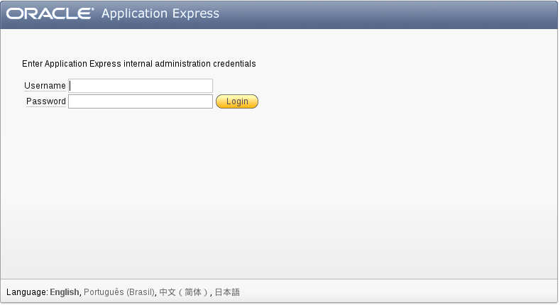

http://192.168.56.11:8080/apex/

.. figure:: ../images/11/02.png

Crear un WorkApace y su tabla
++++++++++++++++++++++++++++++

Ingresamos a http://192.168.56.11:8080/apex/apex_admin con el usuario admin y la clave que colocamos cuando estabamos instaland.

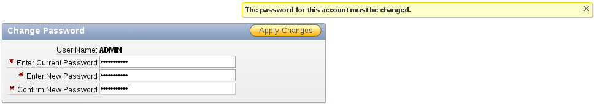

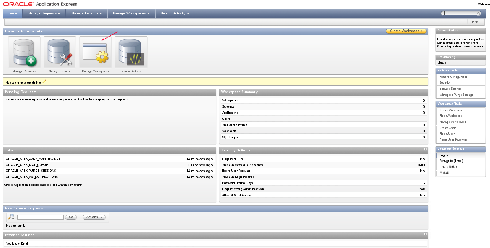

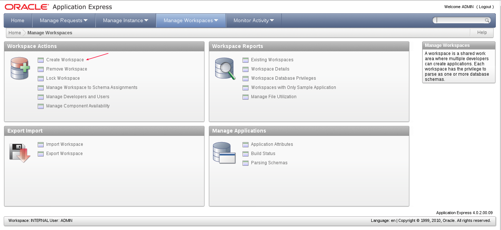

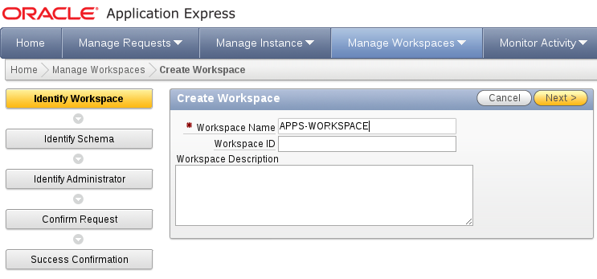

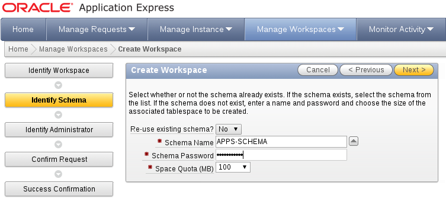

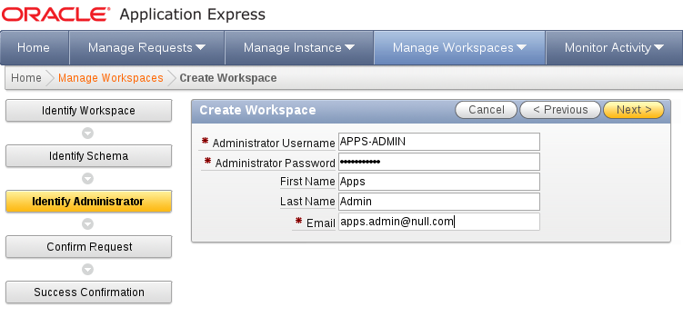

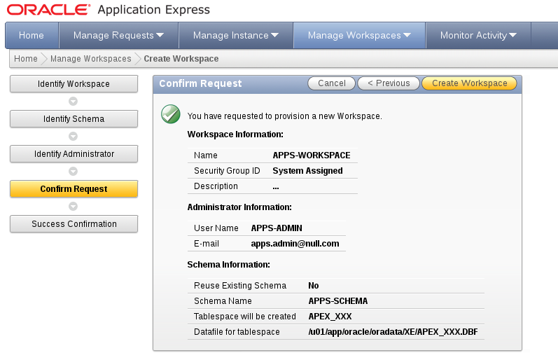

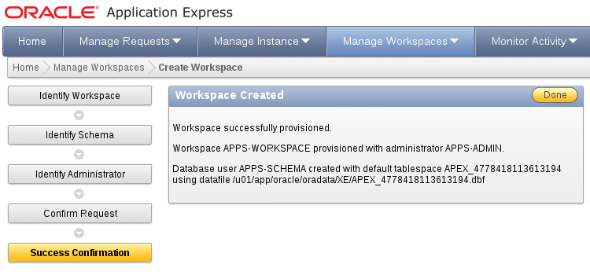

Ahora vamos a crear una tabla dentro de ese workspace, en http://192.168.56.11:8080/apex/

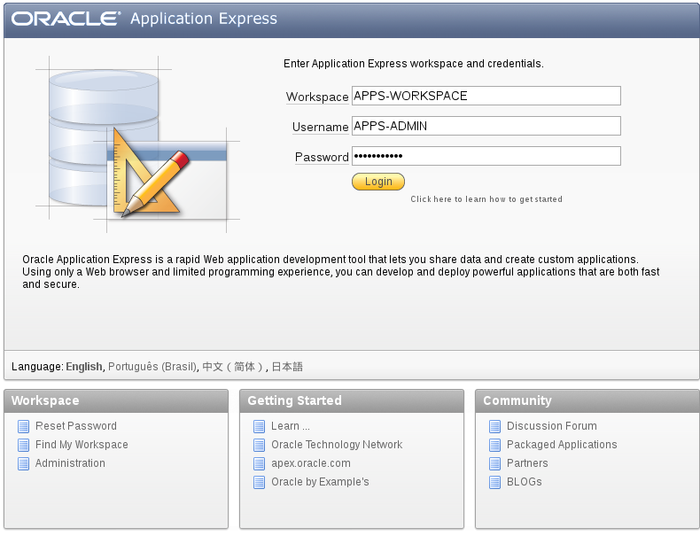

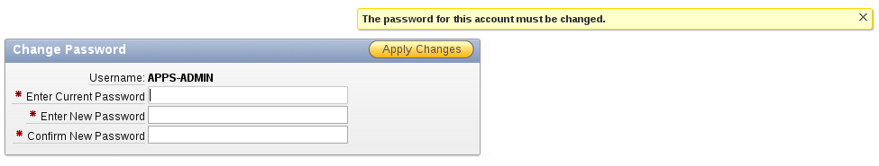

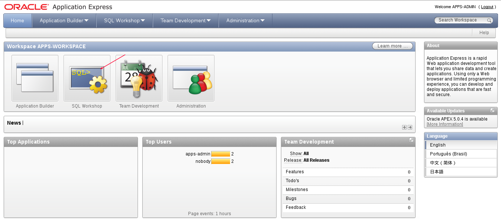

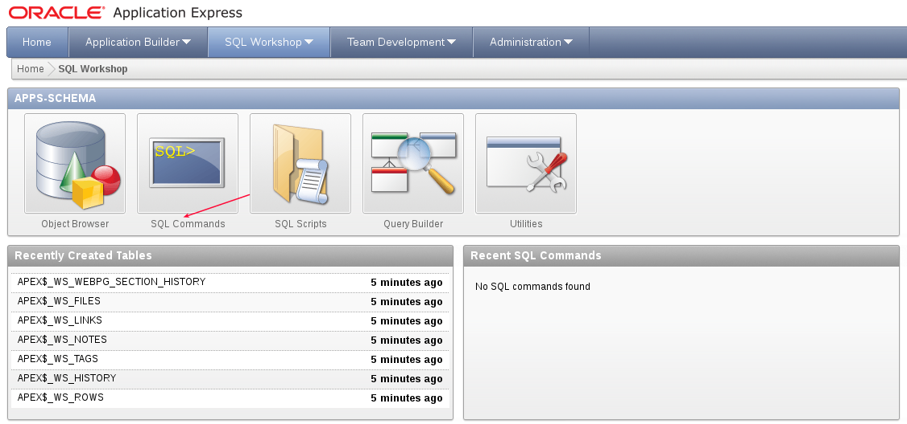

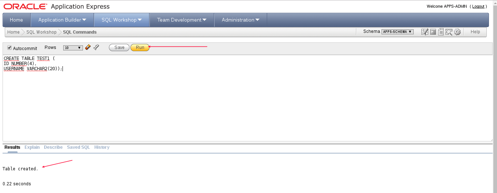

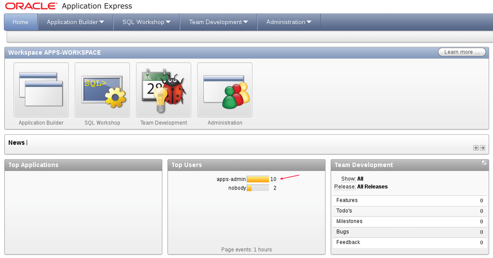

Ahora si olvidamos el password.::

	-bash-4.1$ sqlplus / as sysdba

	SQL*Plus: Release 11.2.0.2.0 Production on Fri Oct 7 10:31:47 2016

	Copyright (c) 1982, 2011, Oracle.  All rights reserved.

	Connected to:
	Oracle Database 11g Express Edition Release 11.2.0.2.0 - 64bit Production

	SQL> alter user system identified by Venezuela21;

	User altered.

	SQL> quit

Nos conectamos a la consola de sqlplus, pero nos validamos primero con el usaurio oracle y nos aseguramos que tenga setada todas las variables.::

	# su - oracle
	$ echo $ORACLE_HOME

	$ 
	$ . /u01/app/oracle/product/11.2.0/xe/bin/oracle_env.sh

	$ORACLE_HOME
	/u01/app/oracle/product/11.2.0/xe

Lo dejamos fijo en el .bash_profile del usuario oracle.::

	$ cd
	$ pwd
	/u01/app/oracle
	$ vi .bash_profile
	. /u01/app/oracle/product/11.2.0/xe/bin/oracle_env.sh

.::

	$ sqlplus system

	SQL*Plus: Release 11.2.0.2.0 Production on Sat Oct 8 16:58:47 2016

	Copyright (c) 1982, 2011, Oracle.  All rights reserved.

	Enter password: 

	Connected to:
	Oracle Database 11g Express Edition Release 11.2.0.2.0 - 64bit Production

	SQL> 

.::

To view database.::
 
	SQL> select * from v$database;
 
To view instance.::
 
	SQL> select * from v$instance;
 
To view all users.::
 
	SQL> select * from all_users;

Ahora para bajar la base de datos y subirla .::

	SQL> conn sys as sysdba
	Enter password:
	Connected.
	SQL> shutdown normal
	Database closed.
	Database dismounted.
	ORACLE instance shut down.
	SQL>

	SQL> conn sys as sysdba
	Enter password:
	Connected.
	SQL> startup

TIPS
+++++++++

	SELECT * FROM APPS-SCHEMA.TEST1;

	Select owner, table_name from dba_tables where table_name = 'TEST1';

	Select * from "APPS-SCHEMA".TEST1;

	SELECT COUNT(*) FROM "APPS-SCHEMA".TEST1;

	truncate table "APPS-SCHEMA".TEST1;

